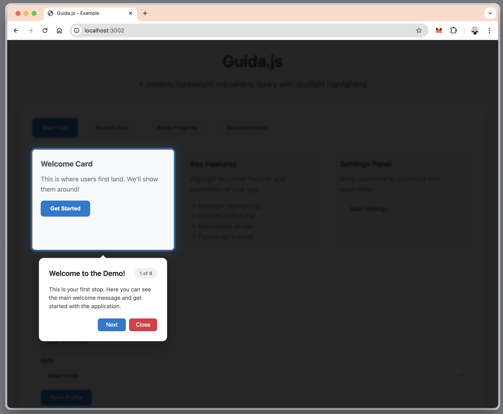

# Guida.js

A modern, lightweight onboarding library with spotlight highlighting and smooth animations. Perfect for guiding users through your application with style.



## Features

- **Spotlight Highlighting** - Elegantly highlight elements with a smooth clip-path effect
- **Streamlined UI Design** - Clean, single-row button layout with Previous, Next, Skip, and Close controls
- **Dynamic Positioning** - Accurate vertical centering for left/right positioned tooltips
- **Customizable Border Radius** - Create rounded spotlight effects with configurable corner radius
- **Responsive Design** - Works perfectly on desktop, tablet, and mobile devices
- **Beautiful Animations** - Smooth transitions and hover effects
- **Dark Mode Support** - Automatically adapts to user's theme preference
- **Accessibility** - Support for high contrast mode and reduced motion
- **TypeScript** - Fully typed for better developer experience
- **Lightweight** - Minimal bundle size with zero dependencies
- **Easy to Use** - Simple API with sensible defaults

## Installation

```bash
npm install guida.js
```

## Quick Start

```typescript
import { Guida } from "guida.js";

const onboarding = new Guida({
  steps: [
    {
      target: "#welcome-button",
      title: "Welcome!",
      description: "Click here to get started with our app.",
      position: "bottom",
      action: "click",
      highlight: true,
      skipable: false,
      spotlight: {
        borderRadius: 12,
        padding: 8,
      },
    },
    {
      target: "#settings-panel",
      title: "Settings",
      description: "Customize your experience here.",
      position: "left",
      action: "observe",
      highlight: true,
      skipable: true,
      spotlight: {
        borderRadius: 16,
        padding: 12,
      },
    },
  ],
  // Global spotlight defaults
  spotlight: {
    borderRadius: 8,
    padding: 8,
    backdropOpacity: 50,
  },
});

// The onboarding will start automatically for new users
// You can also start it manually:
onboarding.start();
```

## API Reference

### Constructor Options

```typescript
interface OnboardingConfig {
  steps: OnboardingStep[];
  storageKey?: string; // Default: 'guida.js-completed'
  autoStart?: boolean; // Default: true
  startDelay?: number; // Default: 1000ms
  spotlight?: {
    borderRadius?: number; // Default: 8px
    padding?: number; // Default: 8px
    backdropOpacity?: number; // Default: 50 (0-100%)
  };
  customClasses?: {
    overlay?: string;
    backdrop?: string;
    tooltip?: string;
    highlight?: string;
  };
  callbacks?: {
    onStart?: () => void;
    onComplete?: () => void;
    onClose?: () => void;
    onStepChange?: (stepIndex: number, step: OnboardingStep) => void;
  };
}
```

### Step Configuration

```typescript
interface OnboardingStep {
  target: string; // CSS selector
  title: string;
  description: string;
  position: "top" | "bottom" | "left" | "right";
  action: "click" | "observe";
  highlight: boolean;
  skipable: boolean;
  spotlight?: {
    borderRadius?: number; // Custom border radius for this step
    padding?: number; // Custom padding for this step
  };
}
```

### Methods

```typescript
// Control the onboarding flow
onboarding.start(); // Start the onboarding
onboarding.nextStep(); // Go to next step
onboarding.previousStep(); // Go to previous step
onboarding.goToStep(index); // Go to specific step
onboarding.complete(); // Complete the onboarding
onboarding.close(); // Close the onboarding
onboarding.restart(); // Restart from beginning

// State management
onboarding.isActive(); // Check if currently active
onboarding.isCompleted(); // Check if completed
onboarding.reset(); // Reset completion status
onboarding.getCurrentStep(); // Get current step info

// Event handling
onboarding.on("start", callback);
onboarding.on("complete", callback);
onboarding.on("close", callback);
onboarding.on("stepChange", callback);
```

## Customization

### Tooltip Design

Guida.js features a clean, minimalist tooltip design with a streamlined button layout:

- **Single-row controls**: All navigation buttons (Previous, Next, Skip, Close) are arranged in a single row at the bottom
- **Smart button visibility**: Previous button only appears on non-first steps, Next button only appears for observation steps
- **Compact progress indicator**: Small pill-shaped step counter (e.g., "2 of 5") in the header
- **Dynamic positioning**: Tooltips automatically measure their content height for perfect vertical centering

```typescript
// The tooltip automatically adapts its button layout based on step configuration
const steps = [
  {
    target: "#first-element",
    title: "Welcome",
    description: "This is the first step.",
    position: "bottom",
    action: "observe", // Shows "Next" button
    skipable: true, // Shows "Skip" button
    // Result: Shows [Next] [Skip] [Close] buttons
  },
  {
    target: "#interactive-element",
    title: "Click Here",
    description: "Click this button to continue.",
    position: "left",
    action: "click", // No "Next" button (waits for user click)
    skipable: false, // No "Skip" button
    // Result: Shows [Previous] [Close] buttons only
  },
];
```

**Positioning Notes:**

- `left` and `right` positioned tooltips are automatically vertically centered relative to the target element
- `top` and `bottom` positioned tooltips are horizontally centered
- All tooltips include arrows pointing to their target elements

### Spotlight Effects

Customize the spotlight highlighting with border radius and padding options:

```typescript
// Global spotlight configuration
const onboarding = new Guida({
  steps: [...],
  spotlight: {
    borderRadius: 16, // Rounded corners for all spotlights
    padding: 12,      // Extra space around highlighted elements
    backdropOpacity: 60 // 60% dark backdrop (applies to all steps)
  }
});

// Per-step spotlight customization (border radius and padding only)
const steps = [
  {
    target: "#rounded-card",
    title: "Rounded Card",
    description: "This card gets a custom rounded spotlight.",
    position: "bottom",
    action: "observe",
    highlight: true,
    skipable: false,
    spotlight: {
      borderRadius: 20, // Overrides global setting
      padding: 16       // Overrides global setting
    }
  },
  {
    target: "#sharp-button",
    title: "Sharp Button",
    description: "This button gets a sharp spotlight.",
    position: "top",
    action: "click",
    highlight: true,
    skipable: true,
    spotlight: {
      borderRadius: 0, // Sharp corners
      padding: 8       // Minimal padding
    }
  }
];
```

**Spotlight Options:**

- `borderRadius`: Corner radius in pixels (0 for sharp corners, higher values for more rounded)
- `padding`: Extra space around the highlighted element in pixels
- `backdropOpacity`: Background darkness as a percentage (0-100, global setting only)

**Visual Examples:**

```typescript
// Light, pill-shaped spotlight
spotlight: { borderRadius: 50, padding: 6 }
// Note: backdropOpacity is set globally

// Standard card-like spotlight
spotlight: { borderRadius: 12, padding: 16 }

// Sharp, minimal spotlight
spotlight: { borderRadius: 0, padding: 4 }

// Highly rounded, spacious spotlight
spotlight: { borderRadius: 24, padding: 20 }
```

### Custom Styling

You can customize the appearance by adding your own CSS classes:

```typescript
const onboarding = new Guida({
  steps: [...],
  customClasses: {
    tooltip: 'my-custom-tooltip',
    highlight: 'my-custom-highlight'
  }
})
```

```css
.my-custom-tooltip {
  background: linear-gradient(135deg, #667eea 0%, #764ba2 100%);
  color: white;
}

.my-custom-highlight::before {
  border-color: #ff6b6b;
  box-shadow: 0 0 0 2px rgba(255, 107, 107, 0.3);
}
```

### Event Handling

```typescript
const onboarding = new Guida({
  steps: [...],
  callbacks: {
    onStart: () => console.log('Onboarding started'),
    onStepChange: (index, step) => {
      console.log(`Now on step ${index + 1}: ${step.title}`)
      // Track analytics
      analytics.track('onboarding_step_viewed', {
        step_index: index,
        step_title: step.title
      })
    },
    onComplete: () => {
      console.log('Onboarding completed!')
      // Show celebration or redirect user
    }
  }
})

// Or use event listeners
onboarding.on('stepChange', ({ stepIndex, step }) => {
  updateProgressBar(stepIndex / steps.length)
})
```

## Advanced Usage

### Conditional Steps

```typescript
const steps = [
  {
    target: "#basic-feature",
    title: "Basic Feature",
    description: "Everyone sees this step.",
    position: "bottom",
    action: "observe",
    highlight: true,
    skipable: false,
  },
];

// Add advanced steps for premium users
if (user.isPremium) {
  steps.push({
    target: "#premium-feature",
    title: "Premium Feature",
    description: "Only premium users see this!",
    position: "top",
    action: "click",
    highlight: true,
    skipable: true,
  });
}

const onboarding = new Guida({ steps });
```

### Multiple Onboarding Flows

```typescript
// Different flows for different user types
const adminOnboarding = new Guida({
  steps: adminSteps,
  storageKey: "admin-guida-completed",
});

const userOnboarding = new Guida({
  steps: userSteps,
  storageKey: "user-guida-completed",
});

// Start appropriate flow based on user role
if (user.role === "admin") {
  adminOnboarding.start();
} else {
  userOnboarding.start();
}
```

### Integration with Router

```typescript
// React Router example
const onboarding = new Guida({
  steps: [...],
  callbacks: {
    onStepChange: (index, step) => {
      // Navigate to appropriate page for each step
      if (step.target.includes('dashboard')) {
        navigate('/dashboard')
      } else if (step.target.includes('settings')) {
        navigate('/settings')
      }
    }
  }
})
```

## Build Output

This library is built to support multiple module systems:

- **`dist/index.js`** - UMD bundle for browser `<script>` tags and CommonJS environments
- **`dist/index.esm.js`** - ES Module bundle for modern bundlers (Webpack, Vite, Rollup) and `import` statements
- **`dist/index.d.ts`** - TypeScript definitions

The ESM build allows for better tree-shaking and is preferred by modern development tools. Most bundlers will automatically choose the appropriate format based on your `package.json` configuration.

## Development

```bash
# Clone the repository
git clone https://github.com/ervan0707/guida.js.git
cd guida.js

# Install dependencies
npm install

# Start development mode (builds library + runs example with hot reload)
npm run dev

# Build the library for production
npm run build

# Run only the example project
npm run example
```

The `npm run dev` command will:

- Build the library in watch mode (automatically rebuilds on changes)
- Start the example server with hot reload
- Both processes run in parallel for seamless development

### Testing

```bash
# Run tests in watch mode (recommended during development)
npm test

# Run tests once and exit
npm run test:run

# Run tests with coverage report
npm run test:coverage

# Open Vitest UI for interactive testing
npm run test:ui
```

The test suite includes unit tests, integration tests, and achieves high code coverage (90%+).

## Contributing

Contributions are welcome! Please feel free to submit a Pull Request. For major changes, please open an issue first to discuss what you would like to change.

## License

This project is licensed under the MIT License - see the [LICENSE](LICENSE) file for details.
